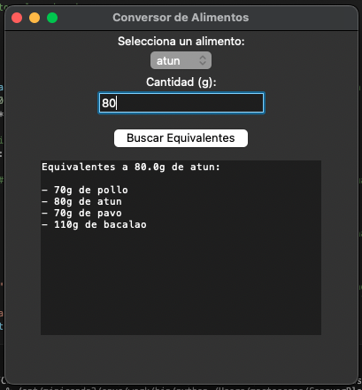

# Equivalencia_alimentos

Aplicación desarrollada en Python, dirigida a personas que siguen una dieta específica y desean, ocasionalmente, variar su alimentación sin modificar significativamente su composición nutricional.

## Funcionalidades

* Diccionario de alimentos con los tres grandes macronutrientes, proteinas, grasas y carbohidratos.
* Entrada de texto donde introducir la cantidad en gramos.
* Caja de texto donde se muestran los aliemntos equivalentes.
* Botón "Buscar Equivalentes" con un solo click o atajo pulsando la tecla "Enter".

Si te interersa esta App, clona el repositorio y actualiza el diccionario con tus alimentos favoritos.

## Librerias

* tkinter
* tkinter: messagebox

# 🖼️ Imagen ventana Conversor de alimentos

# ✉️ Contacto
mactoscan@gmail.com
